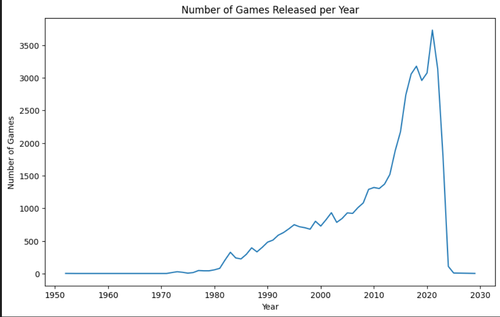
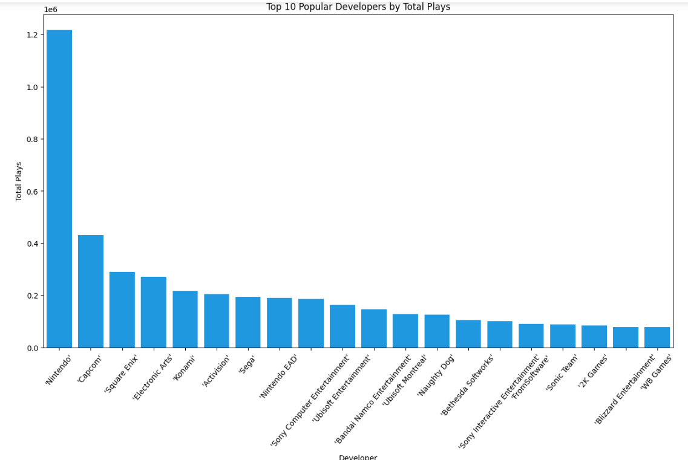
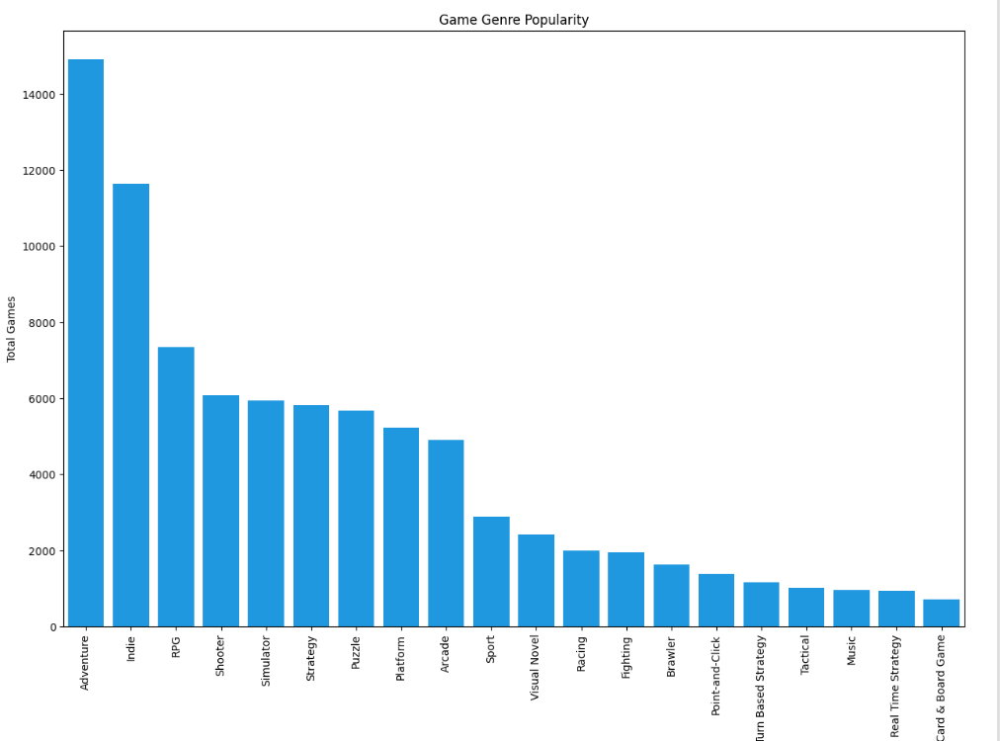
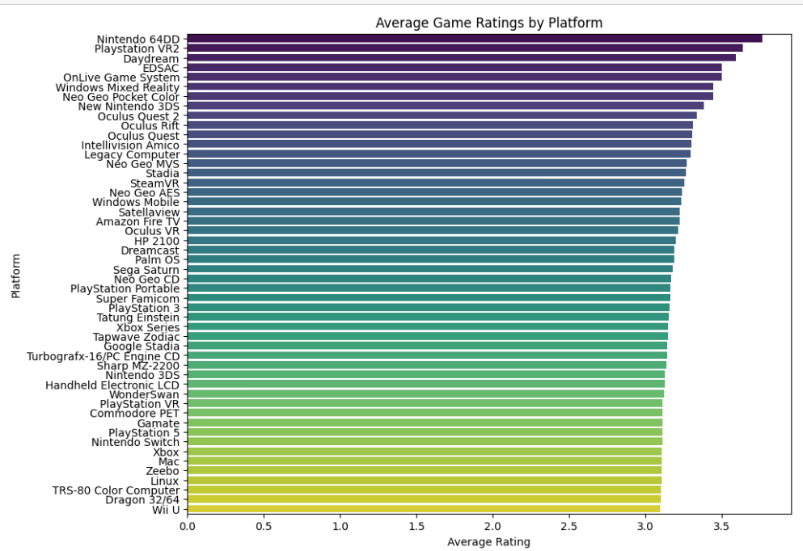
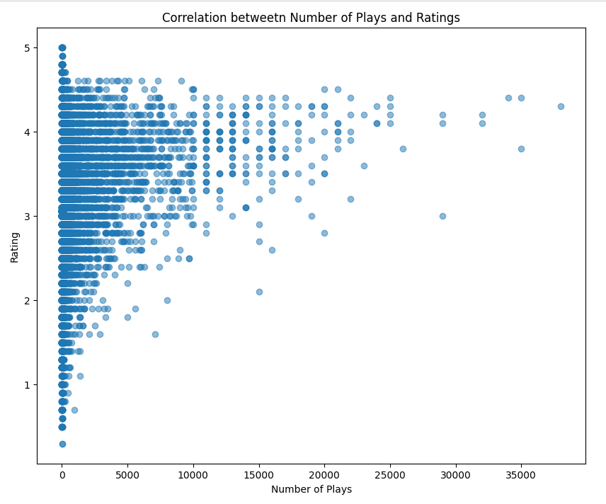
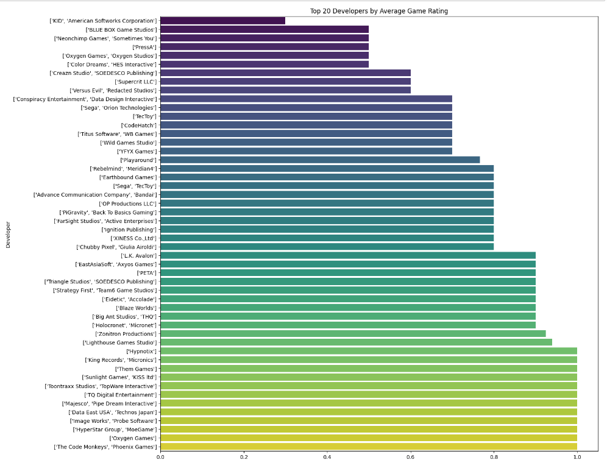
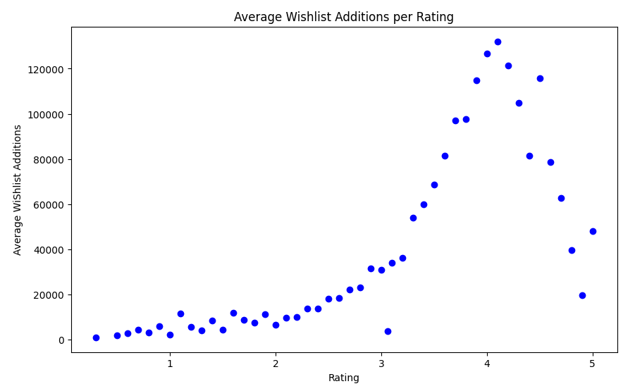
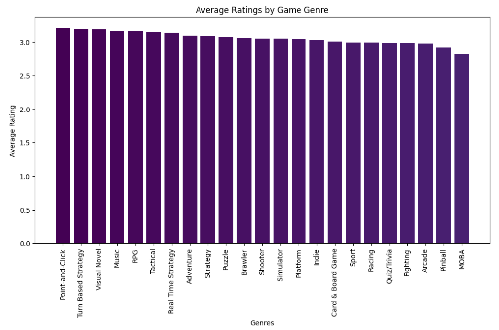
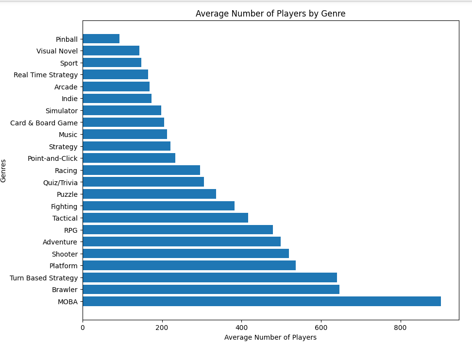
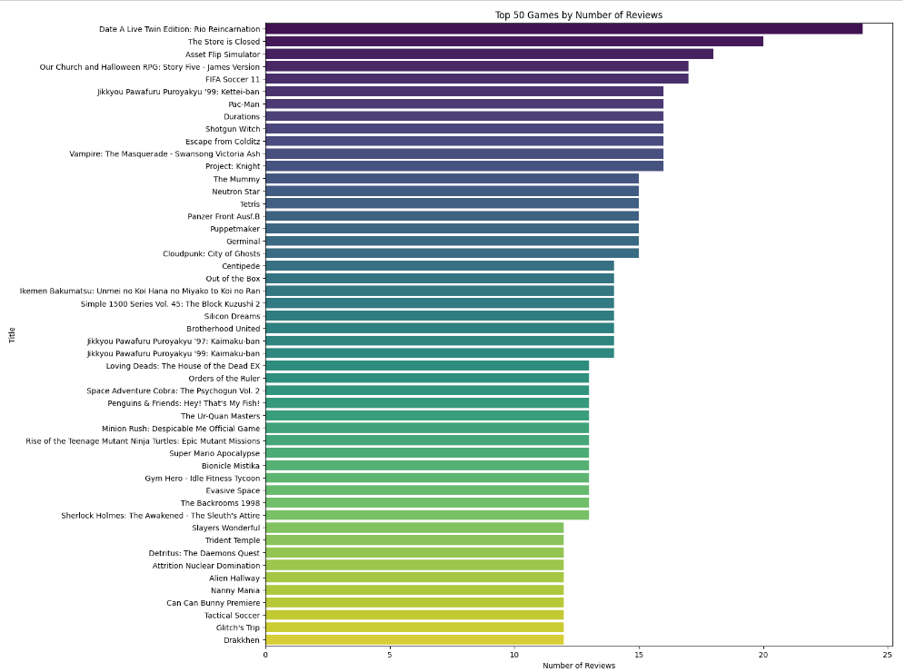

<h2>Popular Video Games Data Analysis</h2>

<h3>Bu Projede Popüler Oyunlar ile ilgili Detaylı Veri Analizi yapıldı.</h3>

<h2>Kullanılan Teknolojiler</h2>

<h2>Projede Oluşturulan Grafikler</h2>

   
